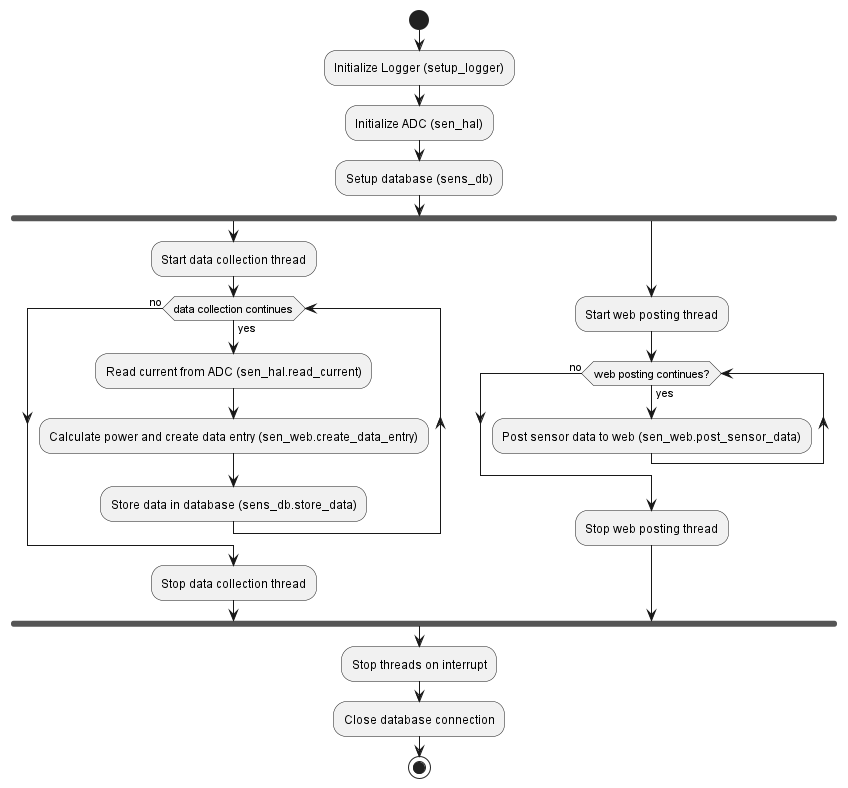
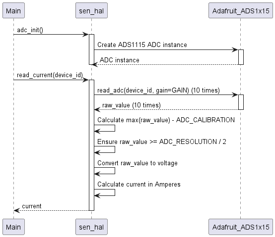
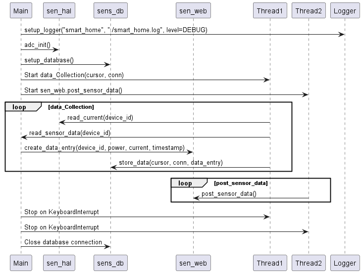

# Smart Home Sensor System Documentation

This document provides an overview of the smart home sensor system, including hardware abstraction, database management, data collection, web posting functionalities, and logging.

---

## HW Design


### HW Components
1. Raspberry Pi 5 with Raspbian OS installed.
2. ACS712 Current Sensor.
3. ADS1115 ADC, 4 Channel 16-bit ADC.
4. Resistors and wiring for voltage measurement setup.

---

## Workflow

1. **Initialize the System**:
   - Initialize the logger module using `setup_logger()`.
   - The ADC is initialized using `sen_hal.adc_init()`.
   - A database connection is established using `sens_db.setup_database()`.

2. **Data Collection**:
   - The `data_Collection` function collects sensor data and stores it in the database.

3. **Web Posting**:
   - The `post_sensor_data` function posts the collected data to a web interface.

4. **Graceful Shutdown**:
   - The script handles interruptions (e.g., `KeyboardInterrupt`) and ensures proper cleanup of resources.

---

## Dependencies

- `time`, `threading`, `logging`: Standard Python libraries.
- `sqlite3`: For database management.
- `requests`: For HTTP requests.
- `Adafruit_ADS1x15`: For hardware abstraction.

---

## Flow Chart



---

## 1. `logger.py` - Logging Module

This module provides functionality for setting up and managing logging throughout the system.

### Functions

#### `setup_logger(name, log_file, level=logging.INFO)`
Sets up a logger with the specified name, log file, and logging level.

##### Parameters:
- **`name`**: The name of the logger.
- **`log_file`**: The file where logs will be written.
- **`level`**: The logging level (e.g., `logging.INFO`, `logging.DEBUG`).

##### Example Usage:
```python
log = setup_logger("smart_home", "./smart_home.log", level=logging.DEBUG)
```

#### `log_message(logger, message, level=logging.INFO)`
Logs a message with the specified logger and logging level.

##### Parameters:
- **`logger`**: The logger instance.
- **`message`**: The message to log.
- **`level`**: The logging level (e.g., `logging.INFO`, `logging.ERROR`).

##### Example Usage:
```python
log_message(log, "System initialized successfully.", level=logging.INFO)
```

#### `get_logger()`
Returns the global logger instance.

##### Example Usage:
```python
log = get_logger()
log.info("This is a log message.")
```

---

## 2. `sen_hal.py` - Sensor Hardware Abstraction Layer

This module provides functionality to interface with an ADC (Analog-to-Digital Converter) and read current values using an ACS712 current sensor.

### Constants

- **`GAIN`**: Gain setting for the ADC. Adjust this based on your voltage range.
- **`ACS712_SENSITIVITY`**: Sensitivity of the ACS712 current sensor in V/A (e.g., 185mV/A for a 5A module).
- **`VREF`**: Reference voltage for the ADS1115 ADC.
- **`ADC_RESOLUTION`**: Resolution of the ADC (16-bit, 32768).
- **`ADC_CALIBRATION`**: Calibration value for the sensor to mitigate inaccuracies in readings.

### Global Variables

- **`adc`**: A global variable to hold the ADC instance.

### Functions

#### `adc_init()`
Initializes the ADC by creating an instance of the ADS1115 ADC.

##### Example Usage:
```python
adc_init()
```

#### `read_current(device_id)`
Reads the current value for a given device ID.

1. Reads the raw ADC value using the `read_adc` method (10 samples).
2. Converts the raw ADC value to voltage using the formula:
   ```python
   voltage = (raw_value / ADC_RESOLUTION) * VREF
   ```
3. Calculates the current in amperes using the formula:
   ```python
   current = (voltage - (VREF / 2)) / ACS712_SENSITIVITY
   ```
4. Returns the calculated current.

##### Parameters:
- **`device_id`**: The ID of the device to read the current for.

##### Returns:
- **`current`**: The calculated current in amperes.

##### Example Usage:
```python
current = read_current(0)
print(f"Current: {current} A")
```



---

## 3. `sens_db.py` - SQLite Database for Sensor Data

This module provides functionality to manage an SQLite database for storing and retrieving sensor data.

### Database Configuration

The database file is named `sensor_data.db`. The table `SensorData` is created with the following schema:

- `id`: An auto-incrementing primary key.
- `deviceid`: A string representing the device ID.
- `timestamp`: A string representing the timestamp of the data.
- `power`: A real number representing the power reading.
- `current`: A real number representing the current reading.

### Functions

#### `setup_database()`
Initializes the database connection and ensures the `SensorData` table exists.

##### Example Usage:
```python
conn, cursor = setup_database()
```

#### `store_data(cursor, conn, data)`
Inserts sensor data into the `SensorData` table.

##### Parameters:
- **`cursor`**: The SQLite cursor object.
- **`conn`**: The SQLite database connection object.
- **`data`**: A dictionary containing the following keys:
  - `deviceid` (str): The ID of the device.
  - `timestamp` (str): The timestamp of the data.
  - `power` (float): The power value.
  - `current` (float): The current value.

##### Example Usage:
```python
data = {
    "deviceid": "0",
    "timestamp": "2025-04-18 12:00:00",
    "power": 230.0,
    "current": 1.0
}
store_data(cursor, conn, data)
```

#### `get_table_row_count()`
Retrieves the total number of rows in the `SensorData` table.

##### Example Usage:
```python
row_count = get_table_row_count()
print(f"Total rows: {row_count}")
```

#### `read_row_by_index(row_index)`
Reads a specific row from the `SensorData` table by its index.

##### Parameters:
- **`row_index`**: The 0-based index of the row to retrieve.

##### Returns:
- **`tuple`**: The row data as a tuple, or `None` if the index is invalid.

##### Example Usage:
```python
row = read_row_by_index(0)
if row:
    print(f"Row data: {row}")
else:
    print("Invalid row index.")
```


---

## 3. `sen_web.py` - Sensor Data Web Posting

This module posts sensor data from the database to a remote server using HTTP requests.

### Constants
- **`URL`**: The URL of the remote server to which the sensor data will be posted.

### Functions

#### `post_sensor_data()`
Posts sensor data from the database to a remote server.

1. Reads rows from the database.
2. Filters and processes data for each device.
3. Sends the data to the server using HTTP POST requests.
4. Implements retry logic for failed requests.

##### Example Usage:
```python
post_sensor_data()
```


---

## 5. `main.py` - Smart Home Sensor Data Collection and Web Posting

This script orchestrates the entire workflow of the smart home system, including data collection, storage, and web posting.

### Constants
- **`DEVICE_IDS`**: A list of device IDs for which sensor data is collected.
- **`VOLTAGE`**: A constant voltage value used for power calculations.

### Functions

#### `read_sensor_data(device_id)`
Reads current values from a sensor and calculates power.

##### Example Usage:
```python
power, current = read_sensor_data(0)
print(f"Power: {power} W, Current: {current} A")
```

#### `data_Collection(cursor, conn)`
Collects sensor data, creates data entries, and stores them in the database.

##### Example Usage:
```python
data_Collection(cursor, conn)
```

#### `main()`
Initializes the logger, system, starts data collection and web posting threads, and manages their lifecycle.

##### Example Usage:
```python
if __name__ == "__main__":
    main()
```



---

## Notes

- The system assumes a constant voltage of 230V for power calculations for Indian households.
- Update the `URL` in `sen_web.py` to match the actual server endpoint.

---

## Example Usage

Run the script using the following command:
```bash
python main.py
```
